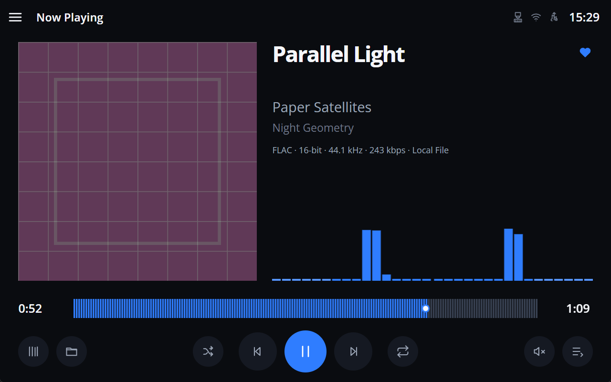
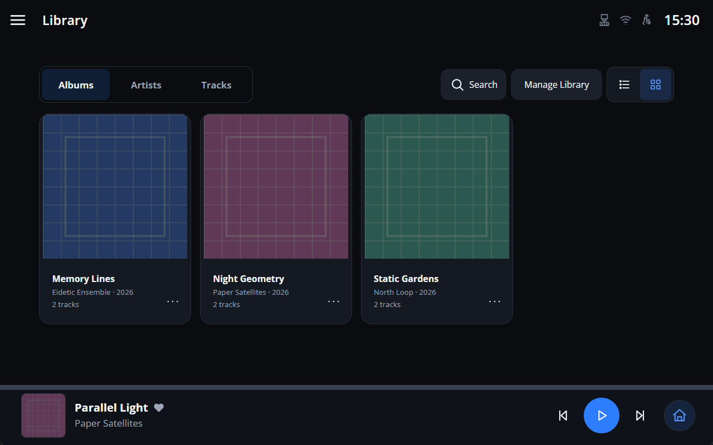
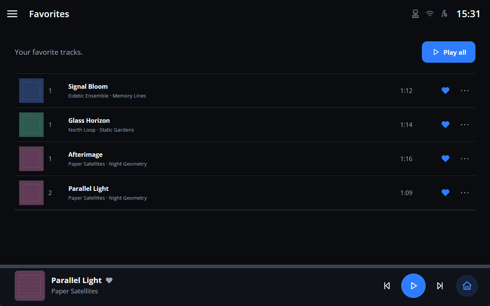
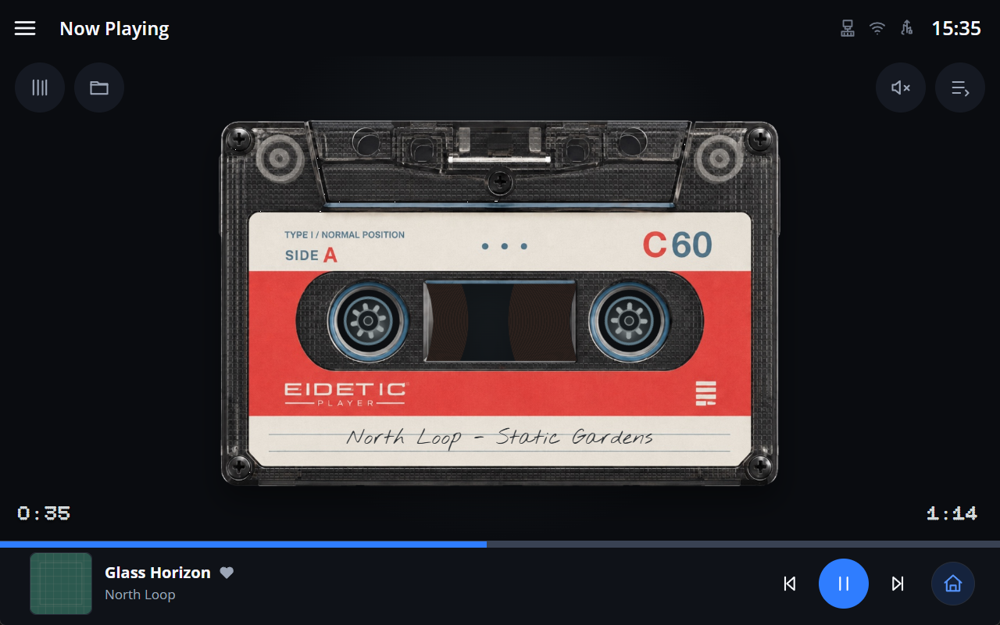

# Eidetic Player

Eidetic Player is a lightweight, touch-first network/local music player for
embedded Linux devices and desktop development. It is designed around an
8-inch, 1280 × 800 landscape display, with Raspberry Pi 3B and later models as
the primary hardware direction. The implemented player currently focuses on
local media; network providers remain roadmap work.

## Current status

Eidetic Player is in active development. The current baseline provides real
MPV playback, an indexed local Library, global Search, Favorite Tracks, two
main-player presentations, and realtime audio visualizations. Windows is the
primary development and native-shell QA environment. Debian/WSLg compatibility
is audited, while complete Raspberry Pi hardware, touch, performance, and
audio-output validation is still planned.

There is no packaged release or installer yet. Run the project from source.

## Gallery

|                                                 Default Player — Stereo Spectrum                                                 |                                                           Library — Albums                                                           |
| :------------------------------------------------------------------------------------------------------------------------------: | :----------------------------------------------------------------------------------------------------------------------------------: |
|  |                     |
|                                                            Favorites                                                             |                                                           Cassette Player                                                            |
|                         |  |

The screenshots come from the real Neutralino application at a 1280 × 800
client viewport. They use an isolated temporary profile and synthetic audio,
metadata, and artwork.

## Overview

The application keeps playback and the interface deliberately small and
separate. Neutralino supplies the native window and file/folder dialogs, a
Node.js backend controls one persistent MPV process through JSON IPC, and the
vanilla TypeScript UI receives authoritative player state through SSE. SQLite
owns the durable Library index. FFmpeg is an optional analysis sidecar and
never becomes the playback engine.

The interface is built for physical touch rather than desktop mouse density.
The 1280 × 800 layout is the ideal target, with responsive emergency layouts
for other supported resolutions without shrinking essential controls below
their touch-safe sizes.

## Features

- Persistent MPV process for playback, seek, volume, mute, shuffle, repeat,
  Previous/Next, and system audio output.
- Stable Queue with direct selection, append, remove, Clear Queue, artwork,
  and paused-at-zero session restore.
- Native Open Files and Add Folder flows. Opening one file natural-sorts its
  non-recursive parent folder and starts exactly at the selected track;
  multi-select preserves only the explicit order.
- Local Sources with automatic first scan, explicit incremental rescans,
  availability state, non-destructive rename/remove, and one-level Folders
  browsing.
- Persistent SQLite Library with Albums, Artists, Tracks, album/artist detail,
  Grid/List album presentation, bounded keyset pagination, and visible
  unavailable catalog entries.
- Global Library Search across Artists, Albums, and Tracks with stable ranking
  and bounded View all pages.
- Persistent Favorite Tracks with Play all, direct contextual playback, Queue
  integration, and shared status in Library, Queue, Default Player, and
  mini-player surfaces.
- Asynchronous metadata and validated embedded/folder artwork with opaque UI
  references and stale-result protection.
- Default Main Player and animated Cassette Main Player, plus the global
  mini-player on browsing screens.
- Mono Spectrum, Stereo Spectrum, enhanced Meter, and Technical visualization
  with Crest Factor and three-second LUFS-S.
- Waveform extraction, responsive touch UI, reduced-motion support, keyboard
  access, and clean process/resource shutdown.
- Ongoing Windows and Linux compatibility work with a Linux GitHub Actions
  gate.

## Hardware target

The primary product target is a Raspberry Pi 3B or later connected to an
8-inch, 1280 × 800 landscape touchscreen and an automatically selected system
audio output or USB DAC. The design budget treats Raspberry Pi 3B constraints
as the default even during Windows development.

Raspberry Pi OS 64-bit and Linux arm64 are prepared and statically audited, but
the project does not yet claim full Pi certification. Real-device validation
still needs to cover installation, sustained CPU/RAM, physical touch, display
startup, ALSA/PipeWire/USB DAC output, kiosk recovery, and clean shutdown.

## Requirements

- Node.js 24.15 or newer; [`.nvmrc`](.nvmrc) currently pins 24.18.0.
- npm and the committed `package-lock.json`.
- MPV, available through `PATH` or `EIDETIC_MPV_PATH`.
- Neutralino runtime assets installed by the repository command below.
- FFmpeg through `PATH` or `EIDETIC_FFMPEG_PATH` for realtime analysis and
  waveforms. Playback remains available without it.
- Windows for the primary development shell, or a Linux graphical environment
  with GTK 3 and WebKitGTK 4.1. Debian 13 under WSL2/WSLg is the audited Linux
  development environment.

MPV and FFmpeg are not downloaded or bundled by this repository.

## Install and first launch

### Windows PowerShell

```powershell
git clone https://github.com/dan88v/eidetic-player.git
Set-Location eidetic-player
npm.cmd ci
npm.cmd run neutralino:update
npm.cmd run mpv:doctor
npm.cmd run ffmpeg:doctor
npm.cmd run dev
```

If MPV or FFmpeg is not in `PATH`, copy the provided environment template and
set absolute executable paths before launching:

```powershell
Copy-Item .env.example .env
```

```dotenv
EIDETIC_MPV_PATH=C:\Tools\mpv\mpv.exe
EIDETIC_FFMPEG_PATH=C:\Tools\ffmpeg\ffmpeg.exe
```

`npm.cmd run dev` starts the backend and Vite, waits for both health barriers,
opens the real Neutralino window, and shuts down its development process tree
when the window closes.

### Linux development

Use a native case-sensitive filesystem rather than `/mnt/c` under WSL. After
installing the GUI, MPV, and FFmpeg prerequisites described in the
[Linux, Debian, and Raspberry Pi guide](docs/development/linux-debian.md):

```bash
npm ci
npm run neutralino:update
npm run doctor:linux
npm run dev
```

The Linux guide also documents the additional compatibility checks. Files in
[`deploy/linux/`](deploy/linux/) are an uninstalled backend-only systemd
prototype, not a production deployment procedure or installer.

## Local development

| Windows command                        | Purpose                                          |
| -------------------------------------- | ------------------------------------------------ |
| `npm.cmd run dev`                      | Start backend, Vite, and the Neutralino shell    |
| `npm.cmd run build`                    | Build the production UI and backend into `dist/` |
| `npm.cmd run format:check`             | Check Prettier formatting                        |
| `npm.cmd run typecheck`                | Type-check UI, backend, and scripts              |
| `npm.cmd run lint`                     | Run ESLint                                       |
| `npm.cmd test`                         | Run the standard Node test suite                 |
| `npm.cmd run mpv:doctor`               | Verify MPV discovery, startup, and JSON IPC      |
| `npm.cmd run test:mpv`                 | Run real silent MPV integration tests            |
| `npm.cmd run ffmpeg:doctor`            | Verify FFmpeg discovery and execution            |
| `npm.cmd run test:ffmpeg`              | Run real FFmpeg analysis integration tests       |
| `npm.cmd run benchmark:library-search` | Benchmark bounded Library/Search operations      |

On POSIX shells, use the same scripts through `npm` instead of `npm.cmd`.
Architecture, UI, testing, performance, security, and workflow rules live in
[`docs/development/`](docs/development/README.md).

## Architecture

```text
Neutralino shell
      │ native dialogs / drop events
      ▼
PlatformBridge ── vanilla TypeScript UI
                       │ REST commands
                       │ player-state SSE
                       │ visualizer SSE
                       ▼
                  Node.js backend ── SQLite Library
                       │
                       ├── JSON IPC ── MPV playback
                       └── PCM ────── optional FFmpeg analysis
```

Shared contracts live in `packages/shared`. Components use central clients,
stores, persistence, and `PlatformBridge`; local paths and binary artwork never
enter UI state. See the [architecture guide](docs/development/architecture.md)
and [Indexed Library guide](docs/development/library-index.md).

## Platforms and current limits

- **Windows:** primary implementation and Neutralino/WebView2 QA platform.
- **Debian 13 amd64 under WSL2/WSLg:** audited development environment with
  Linux x64 runtime preparation.
- **Raspberry Pi OS / Linux arm64:** statically prepared; full runtime and
  hardware validation remains outstanding.
- **Browser fallback:** can render the UI but cannot provide trusted native
  local paths or replace Neutralino validation.

Not yet implemented: Favorite Albums/Artists, Recently Played, playlists,
Vinyl Player, automatic USB mounting, SMB/network-share playback, AirPlay,
Spotify Connect, tag editing, online artwork, and a packaged installer. USB
Storage and Network Shares remain interface placeholders.

## Roadmap

Near-term work focuses on documentation/release readiness, deeper Linux and
Raspberry Pi validation, and measured embedded performance. Later product work
may add Favorite Albums/Artists, history, playlists, additional player
presentations, removable/network sources, and selected network playback
integrations. Roadmap items are not commitments or current functionality.

## License

Eidetic Player is licensed under the
[Apache License 2.0](LICENSE). Bundled fonts and third-party components retain
their own notices and licenses.

## Continuous Integration

The `Eidetic Player CI` workflow runs on `ubuntu-latest` for pushes to `main`,
pull requests targeting `main`, and manual dispatches. It reads Node from
`.nvmrc`, installs reproducibly with `npm ci`, verifies that the lockfile stays
unchanged, audits dependencies, and runs formatting, type-checking, lint,
build, the standard suite, POSIX tests, and case-sensitive import checks.

Hosted CI is a Linux source/build gate, not GUI, playback, or hardware
certification. It does not exercise Neutralino/WebView2 or WebKitGTK, MPV,
FFmpeg, native dialogs, audio hardware, or Raspberry Pi runtime behavior; those
remain real-environment QA responsibilities.
