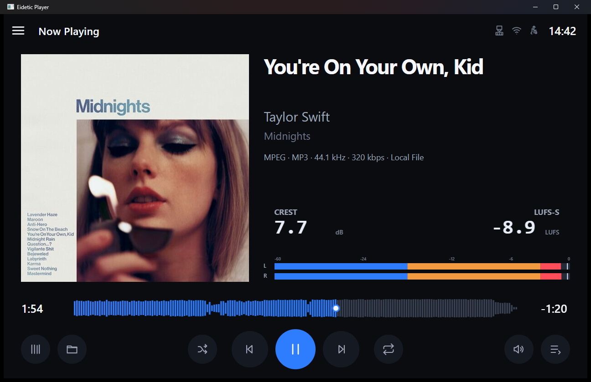
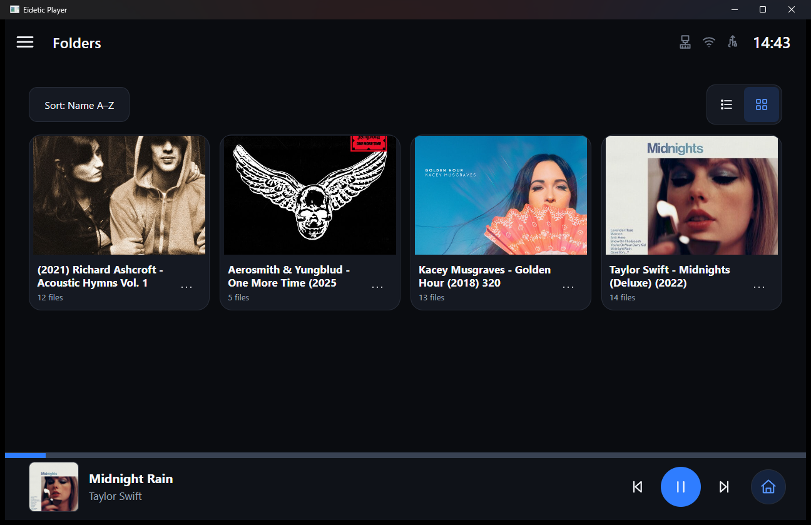

# Eidetic Player

Eidetic Player is a lightweight, touch-first local audio player targeting a
horizontal 1280 × 800 display and a future Raspberry Pi 3B deployment. The
current Step 2.5 build uses a vanilla TypeScript UI, a Node.js control
service, Neutralinojs for native file paths, and one persistent MPV process for
decoding and system audio output.

## Screenshots

### Now Playing — Technical Meter



### Folders



## Requirements

- Node.js 24.15 or newer and npm
- MPV available either as `mpv` in `PATH` or through `EIDETIC_MPV_PATH`
- FFmpeg is optional for real visualizers and waveform generation; configure
  `EIDETIC_FFMPEG_PATH` or make `ffmpeg` available in `PATH`
- Windows for the primary development shell and Debian 13 amd64/WSLg for the
  audited Neutralino Linux development path

MPV is deliberately not bundled, downloaded, or installed by this repository.
After installing it, verify the setup with:

```sh
npm run mpv:doctor
npm run ffmpeg:doctor
```

Copy `.env.example` to `.env` to configure an absolute executable path when MPV
is not in `PATH`:

```dotenv
EIDETIC_MPV_PATH=C:\Tools\mpv\mpv.exe
EIDETIC_FFMPEG_PATH=C:\Tools\ffmpeg\bin\ffmpeg.exe
```

If MPV cannot be verified with `--version`, the backend still starts, health and
player APIs remain available, and the UI shows a clear unavailable state.

## Install and run

```sh
npm install
npm run neutralino:update
npm run dev
```

`npm run dev` starts the backend and Vite, waits for their health checks, and
opens the Neutralino window. Closing the shell or interrupting the command
terminates its development process tree. Vite proxies `/api` to the backend in
development.

## Commands

| Command                     | Purpose                                              |
| --------------------------- | ---------------------------------------------------- |
| `npm run dev`               | Run backend, UI, and Neutralino shell                |
| `npm run build`             | Build production UI and backend into `dist/`         |
| `npm test`                  | Run lightweight Node unit tests through `tsx`        |
| `npm run test:mpv`          | Run the silent optional MPV integration test         |
| `npm run test:ffmpeg`       | Run the optional real FFmpeg analysis integration    |
| `npm run mpv:doctor`        | Verify MPV discovery, headless startup, and JSON IPC |
| `npm run ffmpeg:doctor`     | Verify FFmpeg discovery and version execution        |
| `npm run typecheck`         | Strictly type-check all TypeScript projects          |
| `npm run lint`              | Run ESLint                                           |
| `npm run format:check`      | Verify Prettier formatting                           |
| `npm run neutralino:update` | Update the platform Neutralino runtime               |

## Continuous integration

The `Eidetic Player CI` GitHub Actions workflow runs on `ubuntu-latest` for
pushes to `main`, pull requests targeting `main`, and manual dispatches. It
reads Node from `.nvmrc`, uses the standard npm cache keyed by
`package-lock.json`, installs with `npm ci`, and gates dependency audit,
formatting, type-checking, lint, build, the standard test suite, POSIX tests,
and case-sensitive import checks.

This Linux CI does not exercise Neutralino/WebView2 or WebKitGTK, MPV, FFmpeg,
audio hardware, native dialogs, or Raspberry Pi runtime behavior. Windows
changes still require real application QA with `npm.cmd run dev`; use a native
case-sensitive WSL/Debian clone for Linux diagnosis and platform-sensitive
checks. Raspberry Pi 3B touch, audio, performance, and shutdown validation
remain separate hardware work.

## Local files and queue rules

Supported initial extensions are FLAC, WAV/WAVE, MP3, M4A, AAC, ALAC, OGG,
Opus, AIFF/AIF, WMA, APE, and WV. The list lives once in `packages/shared` and is
used by the native dialog, UI drop filter, backend validation, and tests.

- Opening one file reads only its parent directory's first level, natural-sorts
  supported readable files by name, queues the whole folder, and starts exactly
  at the selected file while MPV prepares the ordered playlist in pause.
- Opening multiple files uses only the explicit selection, keeps its order, and
  removes duplicates while retaining the first occurrence.
- Invalid selections do not replace the current queue. No recursive scan, audio
  decoding, or bulk metadata analysis happens in Node.js.
- Queue `Add Files` appends only the explicit selection without expanding a
  folder or interrupting playback. Individual opaque Queue IDs can be removed;
  `Clear Queue` uses an accessible confirmation and resets playback.

File actions outside the empty Now Playing screen use the native
`PlatformBridge`. Native `filesDropped` events enter the same backend open flow.
A regular browser fallback cannot open trusted absolute local paths and reports
that the native shell is required.

## Local Sources, Folders, and Library

Sources can add a real local folder through Neutralino's native folder dialog.
Rename changes only its display name, while Remove only removes configuration:
media files are never changed or deleted. USB Storage and Network Shares remain
non-functional placeholders.

Sources persist in `%APPDATA%\Eidetic Player\sources.json` on Windows and
`${XDG_CONFIG_HOME:-~/.config}/eidetic-player/sources.json` on Linux using
atomic writes and corruption recovery.

Folders reads one directory level on demand. Its source/folder cards support
persistent sorting and List/Grid preferences, clickable body/artwork Open
targets, per-folder file counts, and lazy real-artwork previews (sidecar first,
otherwise up to four unique embedded covers from the first eight direct audio
files). Folder and audio-row menus expose Play/Add to Queue. Audio rows add compact
container/codec, bitrate, bit-depth, and sample-rate quality without a second
metadata parse. Opening a row or playing a folder uses the existing atomic
`PlayerService` path; adding a folder appends without starting an empty Queue.

Library maintains a recursive, persistent SQLite index of configured Sources.
The Step 2.5 screen shows Tracks, Albums, Artists, Unavailable, scan progress,
last success, Rescan, and cooperative Cancel. First scans run automatically;
later scans are explicit from Library or a Source menu. Incremental scans skip
metadata for unchanged size/mtime pairs. Entity browsing and search are
reserved for Step 2.6.

The database lives at `%LOCALAPPDATA%\Eidetic Player\Data\library.db` on
Windows and `${XDG_DATA_HOME:-~/.local/share}/eidetic-player/library.db` on
Linux. It uses the built-in Node SQLite API, versioned migrations, WAL,
foreign keys, bounded transactions, interrupted-run recovery, and
corruption-preserving rebuild. See the
[Indexed Library guide](docs/development/library-index.md).

Native roots remain backend-only after Add Folder. UI contracts use opaque
source/entry IDs and logical relative paths. Central Windows/POSIX containment
checks block traversal and prefix collisions; symlinks and junctions are not
browsable. The directory LRU is limited to 32 entries.

## Playback behavior

The real controls cover play/pause, previous (restart after three seconds),
next, absolute seek, queue selection, software volume, mute, Shuffle, and Repeat
Off/All/One. Volume, mute, shuffle, repeat, and existing UI preferences persist
locally. Queue order and current-track identity are restored through the
backend session, paused at position zero. Playback position and play/pause
state are deliberately not persisted.

MPV remains authoritative for playback, duration, codec, output sample rate,
audio device, and controls. The backend uses `music-metadata` for asynchronous
tag enrichment and artwork discovery without delaying MPV startup. Missing tags
use filename, Unknown Artist, and Unknown Album fallbacks.

Artwork priority is embedded front cover, then case-insensitive `cover`,
`folder`, and `front` JPEG/PNG/WebP files in the track directory. Images are
validated by MIME and signature and limited to 15 MiB. Embedded images use a
private session directory under the OS temporary directory; the UI receives
only opaque artwork IDs. Current and next-track metadata are cached and
preloaded, while other Queue artwork loads lazily.

## Real analysis and waveform

FFmpeg runs only as a sidecar and never changes MPV's playback signal. One
shared, real-time process decodes stereo float PCM at 24 kHz for a 20 Hz SSE
stream. The internal engine computes honest sample peak, L/R RMS, logarithmic
FFT bands, and a three-second K-weighted LUFS-S value from the same PCM. Meter
uses enhanced dB geometry plus time-based attack/release and peak hold.
Technical mode presents Crest Factor, LUFS-S, and the compact peak-hold stereo
meter; it does not claim true peak, integrated loudness, LRA, or normalization.
Visualizer frames use a small 120 ms presentation lead to compensate for the
combined analyzer, event-stream, and display latency without changing playback.
The analyzer stops on pause, seek, track change, Queue clear, leaving Now
Playing, mode None, or the last subscriber disconnecting.

Waveforms decode mono PCM at 8 kHz without `-re`, aggregate incrementally into
512 normalized points, and use a 64-entry session LRU keyed by canonical file
identity. Current track has priority, followed by the next track. If FFmpeg is
missing or fails, playback continues and the existing deterministic Canvas
graphics remain available.

`EIDETIC_ANALYZER_ENABLED=false` disables real-time analysis and
`EIDETIC_WAVEFORM_PRELOAD_NEXT=false` disables next-track waveform preload.

## Current scope and limits (through Step 2.5)

The Windows/Neutralino runtime currently provides local Sources, one-level
Folders navigation, persistent indexed Library summaries/scanning, persistent
Queue/current-track restore, metadata and artwork enrichment, real waveform
generation, Meter/Mono/Stereo visualizers, and the Technical Crest
Factor/LUFS-S view. Visual QA covers the supported desktop viewports from
1024 × 600 through 1600 × 900.

The following remain outside the implemented scope:

- no indexed Artist/Album/Track browsing, search, or filters yet; Step 2.5
  exposes summary and scan controls only;
- no filesystem watcher, tag editing, online artwork lookup, or generated
  thumbnail service;
- no functional network-share or USB-storage provider and no dedicated DAC
  selection workflow;
- no audio DSP or modification of MPV's playback signal;
- no true-peak meter, integrated loudness, loudness range, or normalization;
- no Raspberry Pi 3B runtime/performance validation; Linux arm64 and Raspberry
  Pi OS remain statically prepared rather than hardware-verified.

See the [Linux/Debian guide](docs/development/linux-debian.md) and the
[Step 2.4.5 report](prompts/step2.4.5_output.md) for the compatibility matrix,
measurements, and remaining Raspberry Pi checks.

See [Architecture](docs/architecture.md) and [UI calibration](docs/ui.md).
