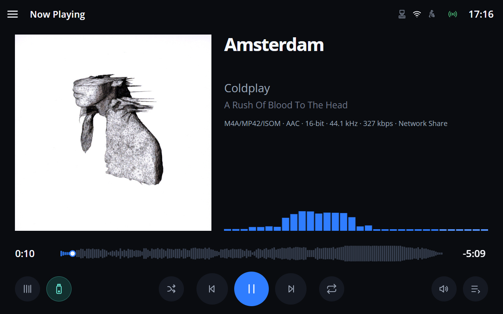
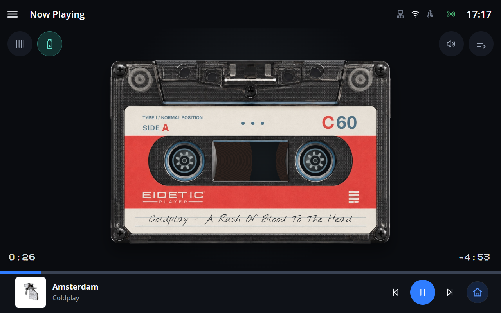
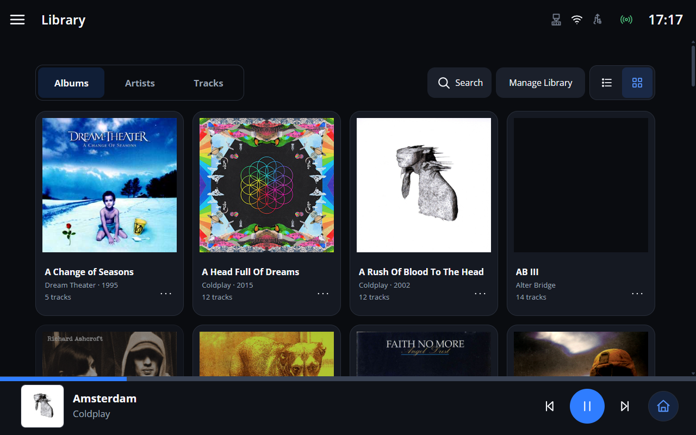
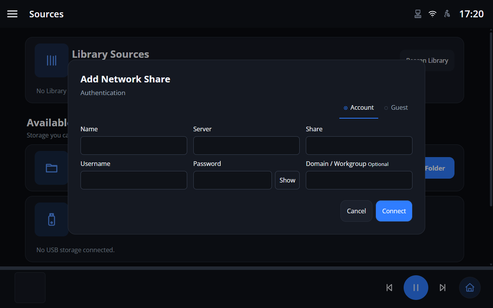
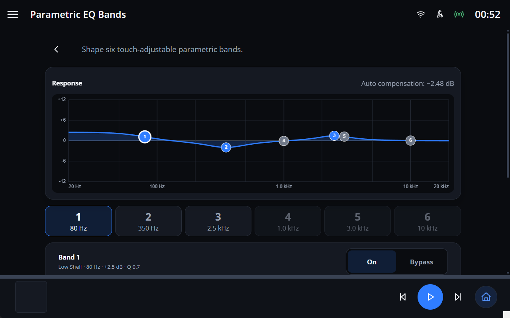

# Eidetic Player

Eidetic Player turns a Raspberry Pi and touchscreen into a complete local and
network music player. It is designed to be used directly on the device, while
the Remote UI provides control from a phone, tablet, or computer on the same
network.

It is lightweight, self-hosted, and local-first: music, settings, favorites,
and listening history stay on your player, with no cloud account required.

> [!IMPORTANT]
> Eidetic Player is under active development. The current feature set has been
> tested end to end on a Raspberry Pi 3B+ running Raspberry Pi OS 64-bit Trixie
> Desktop (Debian GNU/Linux 13.6). Back up your system before installation.



## Features

### Music and library

- Play music stored locally, on USB drives, or in SMB/NAS network folders.
- Browse an indexed collection by Album, Artist, or Track, with fast Search
  and clear handling of temporarily disconnected sources.
- Keep Favorite Tracks, Albums, and Artists, listening History and statistics,
  and local Playlists.
- Build and reorder the Queue, add music without interrupting the current
  track, and use shuffle, repeat, previous/next, and playback restoration.

### Player and remote control

- Choose between the artwork-focused Default Player and the animated Cassette
  Player.
- Seek through a waveform and choose Mono Spectrum, Stereo Spectrum, Meter,
  Technical, or no visualizer.
- Control the player, library, browser, and Queue from a phone, tablet, or
  computer through the local-network Remote UI.
- Receive AirPlay 2 streams and return automatically to the preserved local
  playback session when AirPlay disconnects.

### Sound and output

- Select the physical audio output and use fixed or variable volume.
- Configure channel routing, balance, maximum software volume, and sound
  processing.
- Shape six parametric EQ bands with Low Shelf, Bell, and High Shelf filters.
- Use automatic or manual headroom, with a clear warning when a configuration
  may clip.

### Touchscreen and appliance

- Touch-first controls designed around a 1280 x 800 landscape display, with
  optional mouse and on-screen keyboard support.
- Configure Wi-Fi, DHCP or manual network settings from the player.
- Control display dimming and standby, with playback-aware wake behavior.
- Install verified software updates, keep a rollback version, and enter
  Maintenance mode without leaving the appliance workflow.

## Interface

The main interface is designed for an 8-inch, 1280 x 800 landscape touchscreen
but adapts to other landscape displays.

| Player                                                        | Library                                                   | Sources                                                               |
| ------------------------------------------------------------- | --------------------------------------------------------- | --------------------------------------------------------------------- |
|  |  |  |

### Parametric EQ

The six-band editor supports touch adjustment, shelving and bell filters, and
automatic gain compensation. This example uses one Low Shelf and two gentle
Bell filters, all within ±3 dB.



## Compatibility

| Platform                                                               | Status                                                                                                               |
| ---------------------------------------------------------------------- | -------------------------------------------------------------------------------------------------------------------- |
| Platform                                                               | Status                                                                                                               |
| ---------------------------------------------------------------------- | -------------------------------------------------------------------------------------------------------------------- |
| Raspberry Pi 3B+ · Raspberry Pi OS 64-bit Trixie Desktop (Debian 13.6) | **Tested on real hardware.** The current player functions have been exercised on the target device.                  |
| Raspberry Pi 3B/3B+ · Raspberry Pi OS Lite 64-bit Trixie               | Installer ready for validation on a separate Lite image; full hardware acceptance is still pending.                  |
| Newer Raspberry Pi models · the same Raspberry Pi OS release           | Expected to work with the same 64-bit Trixie system, but not yet tested as completely as the Pi 3B+.                 |
| Ubuntu 26.04 LTS Desktop · amd64 or arm64                              | Supported by the Desktop installer, but **not yet tested on real Ubuntu hardware**.                                  |
| Windows 11 · x64                                                       | Used for development and interface testing. No installer is currently available.                                     |

## Installation

The default and recommended path is Raspberry Pi OS Lite 64-bit, Debian 13 /
Trixie. Flash the image, complete first boot and create a normal user, then run:

```bash
git clone --depth 1 https://github.com/dan88v/eidetic-player.git
cd eidetic-player
sudo ./deploy/linux/install-eidetic-player.sh
```

The Lite installer creates the minimal appliance environment without adding a
full desktop. It does not enable or change SSH and never reboots automatically;
restart the Raspberry Pi manually when installation completes.

For Raspberry Pi OS Desktop Trixie or Ubuntu 26.04 LTS Desktop, use the explicit
Desktop installer:

```bash
sudo ./deploy/linux/install-eidetic-player-desktop.sh
```

The Desktop installer retains the existing Standard and Appliance choices. The
two installers refuse cross-installation rather than converting the operating
system.

For advanced options, recovery, GPIO/I2S DAC setup, or removal, see the
[complete Linux guide](deploy/linux/README.md).

## Updates

Appliance installations can update from **Settings > System > Software
update**. Updates preserve the library, settings, credentials, and installation
choices. The previous version remains available for rollback.

Updates can also be started from the repository:

```bash
sudo ./deploy/linux/update-eidetic-player.sh
```

## Current limitations

- Raspberry Pi OS Lite still requires final validation on a separate physical
  SD image before it can be declared hardware-tested.
- Ubuntu 26.04 LTS Desktop has not been tested on real hardware.
- Spotify Connect, Bluetooth input, radio services, multiroom, and cloud music
  services are not implemented.
- SMB shares must be configured manually.
- Stable releases are not published yet.

Technical and development information is available in
[`docs/development/`](docs/development/README.md).

## License

Eidetic Player is licensed under the [Apache License 2.0](LICENSE). Bundled
fonts and third-party components retain their respective notices and licenses.
