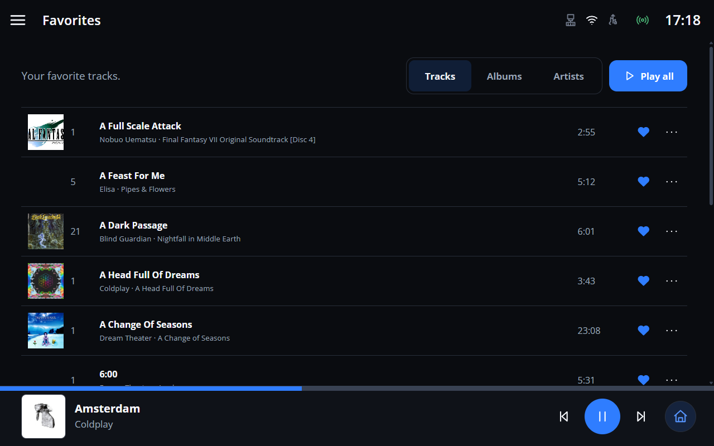

# Eidetic Player

Eidetic Player is a lightweight, touch-first network and local music player
for embedded Linux systems and desktop development. It combines a focused
1280 × 800 interface with persistent MPV playback, an indexed music library,
USB and SMB sources, and optional appliance-style Linux deployment.

> [!IMPORTANT]
> Eidetic Player is in active development. Interfaces, deployment scripts and
> data formats may still change. Raspberry Pi hardware, boot, touch, audio and
> sustained-performance validation are not complete, so this repository should
> not yet be treated as a finished appliance release.

## Project status

The current application is functional and used for real Windows/Neutralino QA.
It includes playback, Library, Favorites, History, Playlists, Local/USB/SMB
sources, network settings, two Main Players and realtime visualizers.

Linux installation tooling is available for narrowly defined Raspberry Pi OS
and Ubuntu Desktop targets. It has automated staging coverage, but a successful
staging run is not Raspberry Pi hardware certification. Step 2.13.4 remains the
real-device validation gate.

## Overview

Neutralino provides the native window and platform dialogs. A Node.js backend
owns application services and controls one persistent MPV process through JSON
IPC. The vanilla TypeScript UI sends ordinary commands over REST and receives
authoritative state through SSE. SQLite stores the indexed Library, while
FFmpeg is an optional analysis sidecar for waveforms and visualizers.

The interface is designed for physical touch and remains responsive at smaller
landscape sizes without turning desktop mouse density into the primary design
target.

## Default Player

The Default Player combines decoded artwork and metadata with a waveform,
realtime Mono Spectrum, complete transport controls and the persistent MPV
playback session.


## Cassette Player

The alternative Cassette Main Player presents overall Queue progress through
physically modelled reels while retaining global utility controls, elapsed and
remaining time, and the complete mini-player.


## Indexed Library

The SQLite-backed Library provides Albums, Artists and Tracks, bounded Search,
validated artwork, incremental cancellable scans and explicit availability for
media that is temporarily disconnected.


## Favorites

Favorite Tracks, Albums and Artists are stored locally and share contextual
playback with the Library, Queue and player surfaces.



## Sources and Network Shares

Sources separates indexed Library Sources from resources available for Quick
Browse. Local folders, USB storage and SMB shares remain distinct, and network
credentials are handled separately from public UI state and contracts.


## Implemented features

### Playback

- One persistent MPV process with seek, volume, mute and system audio output.
- Atomic, stable and reorderable Queue with append, remove and clear actions.
- Session restore, Previous/Next, Shuffle and Repeat.
- Waveform timeline and a global mini-player.

### Main Players and visualizers

- Default and Cassette Main Players.
- Mono Spectrum, Stereo Spectrum, Meter, Technical and None modes.
- Technical mode includes Crest Factor and three-second LUFS-S.
- Reduced-motion handling and stale-frame protection.

### Library and listening data

- Indexed SQLite Library with Albums, Artists and Tracks.
- Search, album/artist detail, Grid/List presentation and unavailable entries.
- Favorite Tracks, Albums and Artists.
- History with Recent, Most Played and Stats.
- Local Playlists and contextual playback.
- Incremental, cancellable scanning with persistent source availability.

### Sources and network

- Local Folders and one-level Quick Browse.
- USB Quick Browse, Library integration, mount status and safe removal.
- SMB connections, Quick Browse and Library integration.
- Read-only remote and removable media access.
- Wired/Wi-Fi status and Wi-Fi management.
- DHCP or manual IPv4 configuration with Keep/Revert rollback.

### Interface

- Touch-first semantic controls and responsive landscape layouts.
- Optional on-screen keyboard.
- Interface, Network and appliance-only System settings.
- Confirmed appliance Maintenance mode with a local return path.

## Hardware and display target

The primary embedded direction is Raspberry Pi 3B and later with Raspberry Pi
OS 64-bit Trixie Desktop and an 8-inch, 1280 × 800 landscape touchscreen. The
UI remains responsive, but no resolution is forced.

Raspberry Pi 3B constraints guide performance decisions. Nevertheless, the
project has not yet completed real-device CPU, RAM, audio, touch, display,
boot, appliance-recovery or sustained-playback certification.

## Supported installation targets

- **Windows:** primary development and real Neutralino/WebView2 QA
  environment; run from source.
- **Raspberry Pi OS:** 64-bit Trixie Desktop on arm64, targeting Raspberry Pi
  3B and later. Hardware validation is still pending.
- **Ubuntu:** Ubuntu 26.04 LTS Desktop on amd64 or arm64. Ubuntu Desktop is not
  declared supported or recommended on a Raspberry Pi 3B.

The production installer intentionally rejects 32-bit systems, Raspberry Pi OS
Lite, generic Debian, Ubuntu Server, other Ubuntu releases and real
installation under WSL.

## Windows quick start

Prerequisites:

- Node.js from [`.nvmrc`](.nvmrc), currently 24.18.0;
- MPV through `PATH` or `EIDETIC_MPV_PATH`;
- FFmpeg through `PATH` or `EIDETIC_FFMPEG_PATH` for analysis and waveforms;
- Microsoft WebView2 and the Neutralino assets used by this repository.

```powershell
git clone https://github.com/dan88v/eidetic-player.git
Set-Location eidetic-player
npm.cmd ci
npm.cmd run dev
```

`npm.cmd run dev` starts the backend and Vite, waits for their health barriers,
opens the real Neutralino window and shuts down the development process tree
when that window closes. This repository does not currently provide a Windows
installer.

Useful diagnostics:

```powershell
npm.cmd run mpv:doctor
npm.cmd run ffmpeg:doctor
```

If the executables are not in `PATH`, copy [`.env.example`](.env.example) to
`.env` and set their absolute paths locally. Do not commit that file.

## Raspberry Pi OS and Ubuntu installation

Read the complete [Linux deployment and trial guide](deploy/linux/README.md)
before running a privileged script. The supported base path is:

```bash
git clone --depth 1 https://github.com/dan88v/eidetic-player.git
cd eidetic-player
sudo ./deploy/linux/install-eidetic-player.sh
```

When `sudo` cannot identify the intended desktop account, pass the existing
runtime user explicitly:

```bash
sudo ./deploy/linux/install-eidetic-player.sh --user "$(id -un)"
```

The installer supports:

- `--user USER` for an existing non-root runtime account;
- `--ref REF`, defaulting to `main`;
- `--mode standard|appliance`;
- `--dry-run`;
- `--unattended`;
- `--root PATH` for an isolated staging filesystem;
- `--help`.

It shows the APT package plan, uses the Node version in `.nvmrc`, verifies the
official Node archive with SHA-256, runs the production checks/build and
switches releases atomically under `/opt/eidetic-player`.

## Standard and Appliance modes

**Standard** installs the desktop application, service integration and
launcher without taking over the graphical session. It does not implicitly
enable autostart, fullscreen, display changes, pointer hiding, splash
replacement or autologin.

**Appliance** asks independently whether to enable:

- automatic start;
- application fullscreen;
- disabled display blanking;
- pointer hiding while inactive;
- the Eidetic Player Plymouth splash;
- graphical autologin for the runtime user.

Unattended appliance installation requires every choice explicitly. No mode
reboots automatically. Appliance capability also enables Settings → System →
Maintenance mode, the `eidetic-player-maintenance` command and the “Return to
Eidetic Player” launcher.

## Update, doctor, restore and uninstall

Run these commands from the checked-out repository:

```bash
sudo ./deploy/linux/update-eidetic-player.sh
sudo ./deploy/linux/update-eidetic-player.sh --rollback
npm run doctor:install:linux
sudo ./deploy/linux/restore-system-ui.sh --dry-run
sudo ./deploy/linux/restore-system-ui.sh
sudo ./deploy/linux/uninstall-eidetic-player.sh
```

Update verifies a new release before switching `current` and retains
`previous`. Configuration, credentials, database and other user data stay in
the runtime user's XDG directories rather than release folders.

Restore touches only system files recorded in the versioned Eidetic manifest.
Uninstall restores managed system UI changes and preserves application data by
default. A deliberate data purge requires both flags:

```bash
sudo ./deploy/linux/uninstall-eidetic-player.sh \
  --purge-data --yes-really-purge-data
```

No installer maintenance command deletes music, NAS content, USB files,
non-Eidetic NetworkManager profiles, shared packages, users or groups.

## Local development

Common Windows commands:

| Command                                 | Purpose                                          |
| --------------------------------------- | ------------------------------------------------ |
| `npm.cmd run dev`                       | Start backend, Vite and Neutralino               |
| `npm.cmd run build`                     | Build production UI and backend                  |
| `npm.cmd run format:check`              | Check formatting                                 |
| `npm.cmd run typecheck`                 | Type-check UI, backend and scripts               |
| `npm.cmd run lint`                      | Run ESLint                                       |
| `npm.cmd test`                          | Run the standard test suite                      |
| `npm.cmd run test:posix`                | Run POSIX-focused tests                          |
| `npm.cmd run test:case-sensitive`       | Check imports on a case-sensitive filesystem     |
| `npm.cmd run verify:network:deployment` | Verify the narrow Linux network deployment files |

Use the equivalent `npm` commands on Linux. A native case-sensitive Linux
filesystem is required for the case-sensitive gate; `/mnt/c` under WSL is not
equivalent. Development rules and deeper guides live under
[`docs/development/`](docs/development/README.md).

## Architecture

```text
Neutralino native shell
        |
        +-- PlatformBridge -- vanilla TypeScript UI
        |                         |
        |                         +-- REST commands
        |                         +-- player-state SSE
        |                         `-- visualizer SSE
        |
        `-- Node.js backend -- SQLite Library
                  |
                  +-- JSON IPC -- persistent MPV playback
                  `-- PCM ------ optional FFmpeg analysis
```

Local, USB and SMB providers share validated Library and browsing boundaries.
`NetworkService` owns network operations and rollback. Shared public contracts
live in `packages/shared`; native paths, credentials and artwork buffers do not
enter frontend state.

See the [architecture guide](docs/development/architecture.md), [Library
guide](docs/development/library-index.md) and [security/accessibility
guide](docs/development/security-accessibility.md).

## Security and local data

- The Linux application runs as the selected non-root user.
- NetworkManager and CIFS use narrowly scoped polkit rules/helpers; the backend
  receives no generic mount privilege or `CAP_SYS_ADMIN`.
- SMB credentials remain outside public API contracts and are never placed in
  Queue or SSE state.
- USB and SMB media are accessed read-only; safe removal never forces eject.
- Linux configuration, cache and data follow XDG directories. Windows uses the
  corresponding per-user application directories.
- Install, update, restore and uninstall reject unsafe paths and administrative
  symlink targets.

## Current limitations

- Raspberry Pi hardware and full appliance boot validation are pending.
- Linux CIFS, NetworkManager, audio and USB behavior still require target
  hardware validation.
- SMB discovery is not automatic; shares are configured explicitly.
- There is no Windows installer.
- Vinyl Player, AirPlay, Spotify Connect and cloud synchronization are not
  implemented.

## Roadmap

The next release-readiness gate is Raspberry Pi hardware validation:
installation, boot, touch, display, audio output, CPU/RAM behavior, network and
storage integration, recovery and shutdown. Later integrations remain
exploratory and are not commitments.

## License

Eidetic Player is licensed under the [Apache License 2.0](LICENSE). Bundled
fonts and third-party components retain their own notices and licenses.

## Continuous Integration

The `Eidetic Player CI` workflow runs for pushes to `main`, pull requests
targeting `main` and manual dispatches. On `ubuntu-latest` it reads Node from
`.nvmrc`, installs with `npm ci`, verifies the lockfile, audits dependencies,
and runs formatting, type-checking, lint, build, the standard tests, POSIX
tests and case-sensitive import checks.

Hosted CI is a Linux source/build gate. It does not validate the
Neutralino/WebView GUI, real audio output, USB/SMB hardware, Raspberry Pi
runtime, boot splash, autologin or complete appliance mode.
